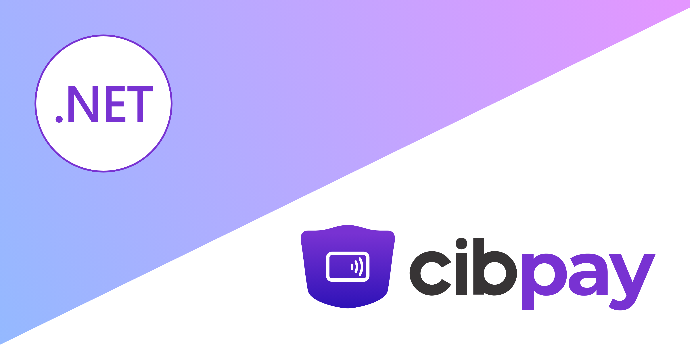

A .NET Library for accessing Cibpay's api, provided as a official library. This Library allows you to integrate Cibpay capabilities into your .NET applications with ease.

⭐ We appreciate your star, it helps! 


 
### Install Packages

[](https://www.nuget.org/packages/Betalgo.Ranul.OpenAI/)
```shell
dotnet add package CibPay.Sdk
```

## Documentation and Links
- [Documentation](https://github.com/betalgo/openai/wiki)
- [Feature Availability Table](https://github.com/betalgo/openai/wiki/Feature-Availability)
- [Change Logs](https://github.com/betalgo/openai/wiki/Change-Logs)
- [Cibpay Website](https://cibpay.az/en/home/)

---

## Acknowledgements
Maintenance of this project is made possible by all the bug reporters, [contributors](https://github.com/betalgo/openai/graphs/contributors)

💖 Premium Sponsor and Support:  [@Cibpay](https://cibpay.az/en/home/)

---

For any issues, contributions, or feedback, feel free to reach out or submit a pull request.
 
Ali Aliyev:  [Ali Aliyev | LinkedIn](https://www.linkedin.com/in/ali-aliyev-57393a168/)  

