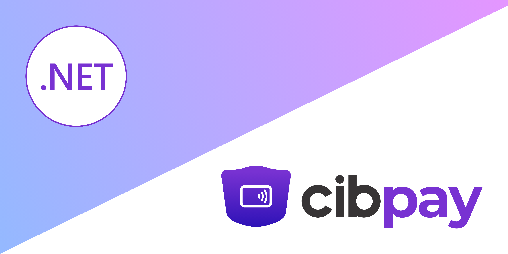

> **⚠️ PREVIEW VERSION** 
> 
> This SDK is currently in preview. Features and APIs may change in future releases. 
> Use in production environments at your own discretion.

---

# CibPay .NET SDK

A comprehensive .NET library for integrating with CibPay's payment processing API. This official SDK provides a simple, secure, and efficient way to implement payment functionality in your .NET applications, specifically designed for the Azerbaijani local banking system.

⭐ We appreciate your star, it helps! 


## Key Features

- **🔒 Secure Authentication** - Certificate-based authentication with basic auth support
- **💳 Order Management** - Create and retrieve payment orders with comprehensive status tracking
- **🏗️ Easy Integration** - Simple client setup with dependency injection support
- **⚡ Async/Await Support** - Modern async programming patterns throughout
- **🛡️ Type Safety** - Strongly-typed models and comprehensive error handling
- **📱 Multi-Platform** - Compatible with console apps, ASP.NET Core, and other .NET platforms

## Quick Installation

[](https://www.nuget.org/packages/Betalgo.Ranul.OpenAI/)

```shell
dotnet add package CibPay.Sdk
```

## Quick Example

```csharp
using CibPay.Http.Configuration;
using CibPay.Sdk;
using CibPaySdk.Core.Models;

// Configure the SDK
var options = new SdkOptions
{
    Username = "your-username",
    Password = "your-password", 
    BaseUrl = "https://api-preprod.cibpay.co",
    CertificatePath = "Certificate/api-cibpay.p12",
    CertificatePassword = "your-cert-password",
    ReturnUrl = "https://yoursite.com/payment/return"
};

// Create client
var client = CibPayClientFactory.Create(options);

// Create an order
var order = await client.Orders.CreateAsync(new CreateOrderRequest 
{ 
    Amount = 100.50m 
});

Console.WriteLine($"Order created: {order.Data.Id}");
```

## Documentation Navigation

### 🚀 Getting Started
- **[Installation](getting-started/installation.md)** - Package installation and prerequisites
- **[Quick Start](getting-started/quick-start.md)** - Step-by-step tutorial for your first payment
- **[Configuration](getting-started/configuration.md)** - Complete configuration guide

### 📚 Core Concepts  
- **[Authentication & Security](core-concepts/authentication.md)** - Certificate setup and security best practices
- **[Order Lifecycle](core-concepts/order-lifecycle.md)** - Understanding order statuses and transitions
- **[Payment Flow](core-concepts/payment-flow.md)** - End-to-end payment process

### 📖 API Reference
- **[Client Setup](api-reference/client-setup.md)** - Client initialization and dependency injection
- **[Order Operations](api-reference/orders/create-order.md)** - Creating and retrieving orders
- **[Models & Types](api-reference/models/request-models.md)** - Request/response models and enums

## Supported Operations

| Operation | Status | Description |
|-----------|--------|-------------|
| Create Order | ✅ Available | Create new payment orders |
| Get Order | ✅ Available | Retrieve order details with expansions |
| Refunds | 🔄 Coming Soon | Process refunds and reversals |
| Webhooks | 🔄 Coming Soon | Handle payment notifications |


## Links & Resources
- **[Github Repository](https://github.com/alistein/cibpay-sdk-dotnet)** - Source code and issues
- **[CibPay Website](https://cibpay.az/en/home/)** - Official CibPay information
- **[.NET Documentation](https://docs.microsoft.com/en-us/dotnet/)** - Microsoft .NET docs

---

## Support & Contributing

💖 **Premium Sponsor and Support**: [@Cibpay](https://cibpay.az/en/home/)

For issues, contributions, or feedback:
- 🐛 [Report Issues](https://github.com/alistein/cibpay-sdk-dotnet/issues)
- 💡 [Feature Requests](https://github.com/alistein/cibpay-sdk-dotnet/discussions)
- 📧 [Contact Developer](https://www.linkedin.com/in/ali-aliyev-57393a168/)

**Maintainer**: Ali Aliyev - [LinkedIn](https://www.linkedin.com/in/ali-aliyev-57393a168/)  

